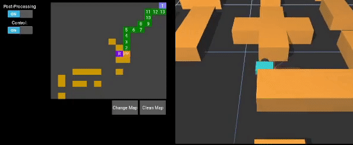
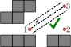
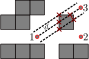

# Mobile-Robotics

An application in Python that implements the A* algorithm and sends the waypoints,
via UDP packets to [SimTwo - A Realistic Simulator for Robotics.](https://github.com/P33a/SimTwo)

 
     

The implementation of A* is based on vertical and horizontal movements on a 16x16 map, internally, the map is stored as
an occupancy grid, with values in the range of [0,1], where 0 represents completely free, and 1 represents fully occupied. 
To update these values, the points from a distance sensors are used, together with the information if these points are
free or occupied. Each occupied point increases the occupancy value by 0.1 of the cell where it is located, and each 
free point reduces the occupancy value by 0.1.

Finally, a post-processing routine was implemented to simplify the path obtained by the A* algorithm. This post-processing uses
3 line segments, parallel and separated by a distance d to each other, and applies the axis-aligned bounding box (AABB)
technique to check for collisions between the 3 line segments and all occupied cells of the map. When this routine is
activated a waypoint with the designation "PP” (Post-Processing) will be displayed.

 
     
    

