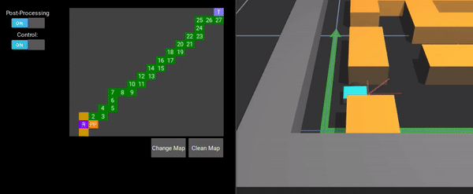

# Mobile-Robotics

An application in Python that implements the A* algorithm and sends the waypoints,
via UDP packets to [SimTwo - A Realistic Simulator for Robotics.](https://github.com/P33a/SimTwo)

The implementation of A* is based on vertical and horizontal movements on a 16x16 map,
where each position is treated as a node of the graph with a weight of 1 between nodes. To facilitate the implementation, the 
HeapDict library was used in order to implement a priority queue.

